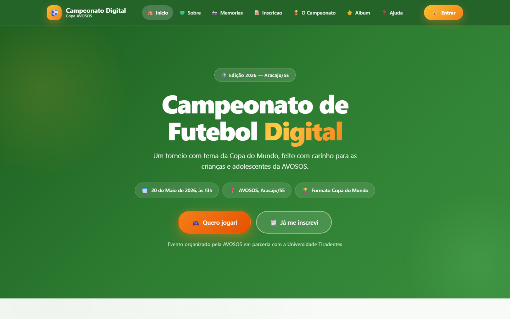
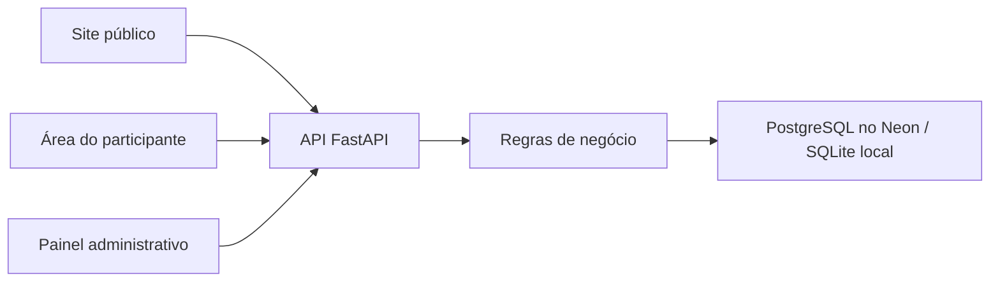

# Copa AVOSOS — Campeonato de Futebol Digital

[](https://github.com/LuKeTempestt/FutSystem/actions/workflows/ci.yml)

Sistema completo para o **Campeonato de Futebol Digital da AVOSOS** (Aracaju/SE), projeto de extensão da **Turma GP0161NOT03A — Universidade Tiradentes (UNIT)** em parceria com a **AVOSOS — Associação dos Voluntários a Serviço da Oncologia em Sergipe**.

Site público, painel administrativo e API no mesmo projeto. Em produção, a aplicação roda na **Vercel** com persistência em **PostgreSQL no Neon**; localmente, funciona com SQLite sem configuração adicional.

> **Projeto acadêmico de impacto social · fevereiro a julho de 2026**<br>
> Desenvolvido na disciplina **Experiência Extensionista I** do curso de Análise e Desenvolvimento de Sistemas da UNIT.



## O problema e a solução

A organização de um campeonato exige concentrar inscrições, formação de grupos,
partidas, placares e comunicação com participantes. O FutSystem reúne esse fluxo
em uma aplicação única, com experiência pública simples e operações sensíveis
restritas ao painel administrativo.

### Minha contribuição

- Desenvolvimento full stack do fluxo de inscrição à gestão do campeonato
- Modelagem do banco e implementação de API REST com controle de acesso por perfil
- Interface responsiva, PWA e área administrativa sem dependência de framework no cliente
- Motor de IA heurística local para distribuir participantes entre grupos com equilíbrio e aleatoriedade, sem modelo ou serviço externo
- Testes de regressão e proteção de dados: bcrypt, rate limiting, consentimento auditável e pseudonimização pública

### Decisões técnicas que o projeto demonstra

- **Backend e regras de negócio:** FastAPI, Pydantic e SQLAlchemy
- **Segurança:** autorização no servidor, JWT assinado com expiração e revogação persistente
- **Privacidade:** contatos ficam na área administrativa; páginas públicas usam nome reduzido
- **Persistência:** PostgreSQL no Neon em produção e SQLite no desenvolvimento local
- **Deploy:** FastAPI serverless e front-end estático publicados juntos na Vercel
- **Qualidade:** testes automatizados e CI no GitHub Actions



---

## 📚 Onde encontro o quê

| Documento | Use quando você... |
|---|---|
| **README.md** (este) | Quer entender o projeto, a arquitetura e onde tudo fica |
| **[INSTALACAO.md](INSTALACAO.md)** | Vai instalar o sistema num computador novo |
| **[OPERACAO.md](OPERACAO.md)** | Vai usar o sistema no dia do evento (admin, equipe da AVOSOS) |
| **[backend/README.md](backend/README.md)** | É desenvolvedor e precisa da referência técnica da API |

---

## 🎯 Visão geral

### O que o sistema faz

- **Site público** — Apresenta o evento (sobre, memórias, ajuda, grupos, classificação)
- **Inscrição** — Participantes criam conta com username + senha
- **Entrada controlada** — O cadastro exige um código de convite configurado pela organização
- **Área do usuário** — Cada participante vê seu grupo, partidas e perfil
- **Painel admin** — Equipe organiza grupos, registra placares, gera chaveamento, gerencia administradores
- **Execução local segura por padrão** — O servidor inicia apenas em `localhost`

### Stack técnica

| Camada | Tecnologia |
|---|---|
| Front-end | HTML5 + CSS3 + JavaScript vanilla (sem build, sem dependências) |
| Back-end | **Python 3.12 · FastAPI · SQLAlchemy 2.0** |
| Banco | **PostgreSQL (Neon)** em produção · **SQLite** local |
| Auth | JWT Bearer com revogação persistente · senhas bcrypt com salt individual |
| Deploy | **Vercel Functions** com configuração versionada |
| PWA | Manifest + Service Worker (cache offline) |
| Acessibilidade | WCAG 2.2 AA |

---

## 🗂️ Estrutura de pastas

```
FutSystem/
│
├── start.bat                # ▶️ Windows — duplo clique para iniciar tudo
├── start.sh                 # ▶️ Linux/macOS — equivalente
│
├── index.html               # 🏠 Página inicial pública
├── sobre.html               # 💚 Sobre a AVOSOS + mascotes
├── memorias.html            # 📸 Página de memórias
├── inscricao.html           # 📝 Formulário de inscrição (cria conta de usuário)
├── login.html               # 🔓 Login (usuário ou admin)
├── minha-area.html          # 🪪 Área pessoal do usuário logado
├── campeonato.html          # 🏆 Grupos, classificação, fixture, Fair Play
├── album.html               # ⭐ Álbum de figurinhas dos participantes
├── ajuda.html               # ❓ FAQ + contato
├── admin/index.html         # ⚙️ Painel restrito (apenas role=admin)
│
├── css/
│   ├── styles.css           # Estilos do site público
│   └── admin.css            # Estilos do painel admin
│
├── js/
│   ├── storage.js           # Camada localStorage (fallback offline)
│   ├── api.js               # Cliente HTTP do backend
│   ├── data.js              # Camada unificada (API + localStorage)
│   ├── components.js        # Header e footer compartilhados
│   ├── main.js              # Menu mobile, countdown, PWA, toast
│   ├── inscricao.js         # Lógica do form de inscrição
│   ├── campeonato.js        # Render dinâmico do campeonato
│   ├── album.js             # Render do álbum
│   └── admin.js             # Painel admin completo
│
├── manifest.json            # PWA manifest
├── service-worker.js        # Cache offline
├── api/index.py             # Entrada serverless da Vercel
├── vercel.json              # Função, arquivos estáticos e headers de segurança
├── requirements.txt         # Dependências detectadas pela Vercel
├── .env.example             # Variáveis necessárias, sem valores reais
│
├── backend/                 # ⚙️ Servidor Python
│   ├── main.py              # App FastAPI + todas as rotas
│   ├── database.py          # Engine SQLAlchemy + Session
│   ├── models.py            # ORM: Grupo, Inscricao, Partida, Config, FairPlay, Usuario
│   ├── schemas.py           # Pydantic — validação de I/O
│   ├── crud.py              # Operações + regras de negócio
│   ├── auth.py              # bcrypt, JWT e dependências de role
│   ├── request_protection.py # Limites de requisição antes do parsing
│   ├── requirements.txt     # Dependências Python
│   ├── run.py               # Atalho de inicialização
│   ├── README.md            # Referência técnica do backend
│   └── futsystem.db         # Banco SQLite local (criado no 1º start)
│
├── README.md                # 📖 Este arquivo
├── INSTALACAO.md            # 🔧 Como instalar
└── OPERACAO.md              # 🎮 Como operar no dia do evento
```

---

## 🔐 Tipos de conta (controle de acesso)

O sistema tem dois tipos de conta, cada uma com permissões diferentes:

### 👤 Usuário (`role = 'user'`)
- Criado automaticamente quando alguém preenche o formulário de **Inscrição**
- Faz login com `username + senha` (escolhidos pelo participante)
- **Pode:** ver dados próprios, ver grupo, ver partidas próprias, trocar a senha
- **Não pode:** acessar o painel admin, modificar outros usuários, alterar o evento

### 🛡️ Administrador (`role = 'admin'`)
- Localmente, a pessoa responsável escolhe a senha inicial em uma entrada oculta no terminal
- Na Vercel, a senha inicial vem do segredo `FUTSYSTEM_ADMIN_PASSWORD`
- A senha precisa ter entre 12 e 128 caracteres e nunca é exibida pelo sistema
- Pode ser criado pelo painel admin (Seção 🔐 Administradores)
- **Pode tudo:** gerenciar inscrições, grupos, partidas, chaveamento, Fair Play, criar outros admins, resetar dados, alterar configurações

### Como funciona na prática

```
1. Pessoa nova chega no site → preenche INSCRIÇÃO → senha + username criados
2. Participante volta → entra com username/senha → vai pra MINHA ÁREA
3. Equipe AVOSOS → entra com login admin → vai pro PAINEL ADMIN
4. Cada um vê apenas o que sua role permite
```

> **Não é mais WhatsApp como login.** WhatsApp agora é só dado de contato (e não precisa mais ser único — irmãos podem usar o mesmo número do responsável). A identidade real da conta é o **username**.

---

## 🚀 Como iniciar (resumido)

### Windows

```
Duplo clique em start.bat
```

Na primeira vez, ele instala automaticamente. O navegador abre em `http://localhost:8001`.
O inicializador também solicita um código de convite de 8 a 64 caracteres para
impedir cadastros públicos não autorizados.

### Linux/macOS

```bash
./start.sh
```

> Guia completo passo a passo em **[INSTALACAO.md](INSTALACAO.md)**.

Em ambientes automatizados, defina `FUTSYSTEM_REGISTRATION_CODE` antes de iniciar
o servidor. Não publique esse código no repositório.

### Testes automatizados

```bash
python -m pip install -r backend/requirements-dev.txt
python -m unittest discover -s backend/tests -v
```

O mesmo conjunto é executado automaticamente pelo GitHub Actions em cada pull request e atualização da `main`.

### Publicação na Vercel com Neon

O projeto está preparado para uma única implantação: a Vercel executa o FastAPI e entrega o front-end; o Neon mantém os dados fora das instâncias serverless.

Cadastre estas variáveis nos ambientes **Preview** e **Production** da Vercel:

| Variável | Uso |
|---|---|
| `DATABASE_URL` | URL agrupada do Neon, com host `-pooler` e SSL |
| `FUTSYSTEM_ADMIN_PASSWORD` | Senha inicial forte do administrador |
| `FUTSYSTEM_JWT_SECRET` | Segredo aleatório com pelo menos 32 caracteres |

Não publique valores reais no GitHub. O arquivo `.env.example` contém apenas o formato esperado.

### Acesso pela rede

Por segurança, os scripts oficiais escutam somente em `127.0.0.1`. Para atender
outros dispositivos, coloque a aplicação atrás de um proxy HTTPS confiável e
defina `FUTSYSTEM_HOST` apenas dentro dessa topologia protegida. Não envie senhas,
tokens ou dados de participantes por HTTP aberto na rede Wi-Fi.

---

## 💾 Persistência dos dados

Em produção, os dados ficam no PostgreSQL do Neon e sobrevivem a novas implantações e reinicializações da Vercel. Localmente, ficam em `backend/futsystem.db`; o arquivo é ignorado pelo Git para impedir a publicação de dados pessoais e hashes de senha.

| Operação | Como fazer |
|---|---|
| Local | Criar uma cópia consistente de `backend/futsystem.db`, criptografada e com acesso restrito |
| Produção | Usar backup e restauração do Neon; nunca versionar exportações com dados pessoais |
| Reset administrativo | Usar a operação protegida do painel apenas quando necessário |

O banco contém dados pessoais e hashes de senha. Nunca o envie por e-mail nem o
coloque sem criptografia em nuvem ou mídia removível. Use armazenamento controlado,
MFA, acesso mínimo, prazo de retenção e exclusão segura.

---

## 🎨 Identidade visual

Identidade visual definida para o projeto:

- **Verde principal:** `#2E7D32`
- **Verde escuro:** `#1B5E20`
- **Âmbar (CTA):** `#F57F17`
- **Amarelo (destaques):** `#FBC02D`
- **Texto:** `#1A1F22` sobre fundos claros (contraste 13.8:1 ✅)
- **Tipografia:** pilha de fontes do sistema, sem requisições a terceiros
- **Proibido:** azul frio, cinza clínico, ícones médicos

---

## 🛡️ Acessibilidade

- Interface projetada com práticas alinhadas à WCAG 2.2 AA
- Contraste do verde principal sobre branco verificado em 7.4:1
- Alvos de toque ≥ 48×48px
- Navegação por teclado completa (`Tab`, `Shift+Tab`, `Enter`)
- `:focus-visible` âmbar bem visível
- Mensagens de erro humanizadas (sem "Erro 422" — fala em português claro)
- Suporte a `prefers-reduced-motion`
- Zoom de até 400% sem rolagem horizontal
- Skip link "Pular para o conteúdo principal"

---

## 🤝 Créditos

**Projeto de extensão universitária**
- Turma **GP0161NOT03A — Universidade Tiradentes (UNIT)**
- Parceria: **AVOSOS — Associação dos Voluntários a Serviço da Oncologia em Sergipe** (Aracaju/SE, 2026)

---

## 📄 Licença e uso de marca

O código-fonte está disponível sob a licença MIT. Nomes, marcas e conteúdos
institucionais da AVOSOS e da UNIT pertencem às respectivas organizações e não
são licenciados para reutilização pela licença do código.

---

## 📞 Suporte

- 🔧 Para instalar: leia **[INSTALACAO.md](INSTALACAO.md)**
- 🎮 Para usar no dia do evento: leia **[OPERACAO.md](OPERACAO.md)**
- 💻 Para entender o código / API: leia **[backend/README.md](backend/README.md)**
- 📖 Documentação interativa da API: rode o servidor e acesse `http://localhost:8001/api/docs`
